# T2 Automation Software - User Guide

## Contents
### Starting up:
 - [Start-up Procedures (on RaptorTCU)](#at-start-up-raptortcu---for-both-photometry-and-spectroscopy)
 - [Opening the Dome (on Telcom7)](#opening-the-dome-telcom7)
 - [Platesolving/Guiding (on guestobserver@minervaphotometry)](#platesolvingguiding-on-guestobserverminervaphotometry)
 
 ### Photometry:
 - [Taking a Single Image (Determining Exposure Time)](#taking-a-single-image-determining-exposure-time)
 - [Automated (Continuous) Photometry](#automated-continuous-photometry)
 
 ### Spectroscopy:
 - [Automated Spectroscopy](#automated-spectroscopy)
 
 ### Shutdown Procedures:
 - [Telescope Shutdown Tool](#telescope-shutdown-tool-t2shutdownexe)
 - [Closing the Dome (on Telcom7)](#closing-the-dome-telcom7)
 
 ### Troubleshooting/Tips:
 - [Troubleshooting](#troubleshooting)

<div style="page-break-after: always;"></div>

## At Start-up (RaptorTCU) - For Both Photometry and Spectroscopy
### 1. Connect Wi-Fi internet to 'eduroam' network.
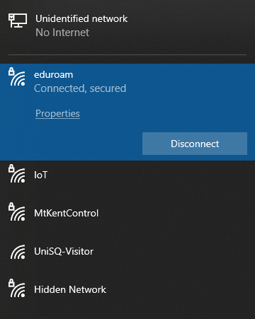

### 2. Ensure Autoslew 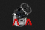 and ASA ACC  are running.
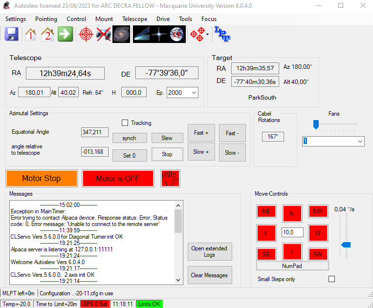   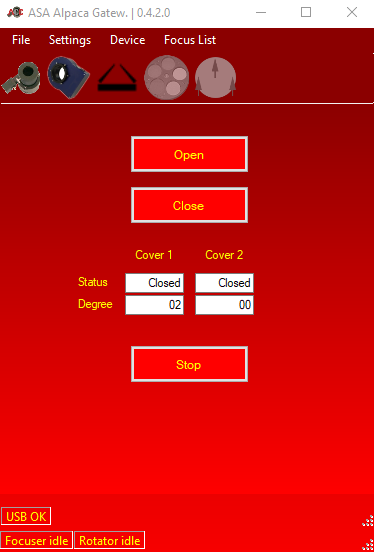

### 3. Open ASCOM Remote  and ensure drivers are connected and the Remote Server is Up.
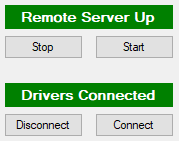

<!-- <div style="page-break-after: always;"></div> -->

If drivers are not connected, e.g. if you see:

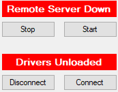

Press 'Connect' and wait for confirmation messages (Note: the filter wheel must not be connected to ANY other software, i.e. ensure MaximDL, NINA etc are closed, or it will not connect), e.g.:

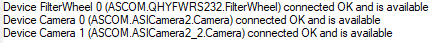

Then press 'Start' and wait for confirmation messages, e.g.:

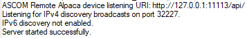

### 4. Open an Automation Terminal from the Desktop -->
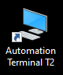

### 5. Confirm Terminal Running or Start New Terminal

In the window that opens, if it says `powershell` in the top left, then a terminal is already open and you can proceed to step 6, e.g.:

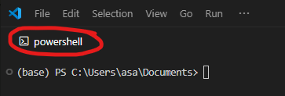

If the window is empty (with some shortcut commands in the centre), then right-click in an empty space and select 'New Terminal', e.g.:


### 6. Activate `drivescope` Environment and Change Directories

Execute the following set of commands to activate the `drivescope` conda environment and change directories to the correct folder.
```bash
conda activate drivescope
cd js\automation
```
The prompt prefix should change to `(drivescpope)`, you should now be in the `automation` folder and your final command prompt should look something like one of these:
```bash
(drivescope) PS C:\Users\asa\Documents\js\automation>
(drivescope) PS C:\Users\asa\Documents\JS\automation>
```
For example:

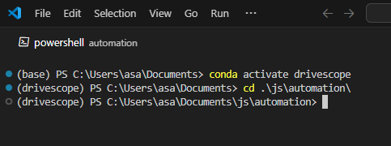

### You are now ready to start running automation scripts.

<div style="page-break-after: always;"></div>

## Opening the Dome (Telcom7)
### 1. Login to Telcom7 and Open the Dome (if safe)

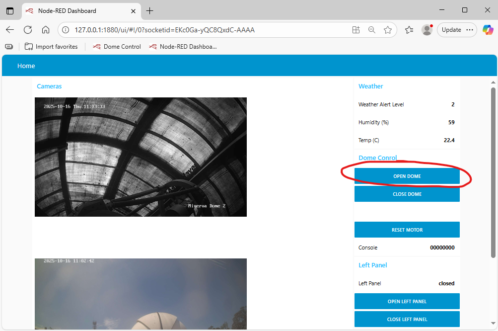

### 2. Confirm Dome has Opened via Cam

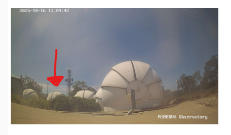

<div style="page-break-after: always;"></div>

## Platesolving/Guiding on guestobserver@minervaphotometry

### 1. Check current Workspaces

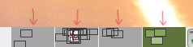 Log into guestobserver@minervaphotometry and check each of the active Workspaces, selectable from the bottom right of the window -->

Look for active terminal windows, specifically one running in `~/guidercode`, e.g.:

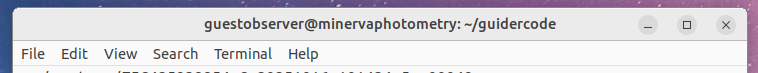

The terminal should be running a program (i.e. there will be no active command prompt), likely displaying the last frame it solved, e.g.:

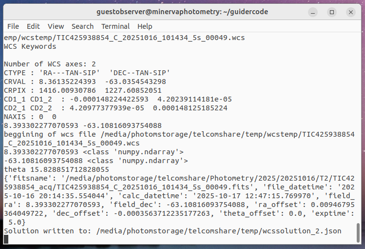

This terminal is running the platesolving program and no further action is required.<br>
You may safely exit guestobserver@minervaphotometry.

### 2. Start platesolver if not already running

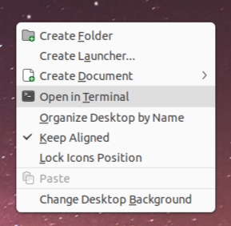

If the platesolver is not running in any active Workspaces, open a new terminal window by right-clicking somewhere on the empty Desktop and selecting "Open in Terminal", e.g. -->

In the empty terminal window, type the following sets of commands to change directories, initialise python and start the platesolver (Note: it will immediately try to solve the most recent photometry frame, this is fine):


### 3. You may now safely exit guestobserver@minervaphotometry

<div style="page-break-after: always;"></div>

# Taking a Single Image (Determining Exposure Time)
You may wish to take a single image (or a series of single images) to confirm you have the correct target and to determine the optimal exposure time for your target.

### Important Notes:
- Cover operations: This program will NOT close the covers after an image is taken, you must close the covers manually if there are no further observations.
- Telescope parking: This program will NOT park the telescope after an image is taken, it will turn its motors off, but it will remain at its location.
- Camera coolers: This program will NOT initiate the camera's coolers.

The program to take a single image is called via:
```bash
python t2_singleimage.py [TARGET] [OPTIONS]
```
## Basic Usage

### Using TIC ID
Any of these formats are acceptable:
```bash
python t2_singleimage.py 123456789 [OPTIONS]
python t2_singleimage.py TIC123456789 [OPTIONS]
python t2_singleimage.py TIC-123456789 [OPTIONS]
```
Target coordinates will be determined via TIC lookup. **The exposure time must be entered using command line arguments.**

### Command Line Arguments
Command line arguments can be used for additional customization and to override program defaults.

| Option | Description | Default |
|--------|-----------|:---------:|
|`-h` or `--help` | Displays help message and exits | `-` |
|`--exposure-time` (**Required**) | Exposure time in seconds for the image | `-` |
|`--coords` | Resolves target based on J2000 coordinates ("RA_DEG DEC_DEG") instead of TIC ID | `-` |
|`--current-position` | Take image at current position (no telescope slewing, no observability checks) | `False` |
|`--filter` | Selects the filter to use (L/B/G/R/C/I/H) | `C` |
|`--log-level` | Terminal display logging level (DEBUG/INFO/WARNING/ERROR) | `INFO` |
|`--ignore-twilight` | Bypass twilight (Sun Altitude) checks for daytime testing | `False` |

Notes:
- Filter options: L=Lum, B=Blue, G=Green, R=Sloan-r, C=Clear, I=Sloan-i, H=H-alpha 
- Focuser position: The focuser position will automatically change based on the filter selected and pre-defined values in `config\devices.yaml` (under focuser['focus_positions']), you may need to manually alter the focuser position based on seeing conditions (it will auto-reset to config position for each new image).
- Observability: The program will check that the target is above 30° altitude and confirm that the Sun's altitude is low enough to allow observations. Using the `--ignore-twilight` command line argument will bypass Sun altitude checks and should only be used for daytime testing purposes with the dome closed. The program will terminate if either observability condition is not met.

#### Examples
- To observe a TIC target with 5 second exposure time:
```bash
python t2_singleimage.py 123456789 --exposure-time 5.0
```
- To observe a TIC target with 10 second exposure time using the Lum filter:
```bash
python t2_singleimage.py 123456789 --exposure-time 10.0 --filter L
```
- To observe a target without a TIC ID via its J2000 coordinates (RA and Dec in decimal degrees) with 20 second exposure time with the Clear filter (Clear is the default):
```bash
python t2_singleimage.py --coords "256.263748 -42.17295" --exposure-time 20.0
```

#### Determining Optimal Exposure Time
Images are saved to the following directory (based on the observation date):
```
P:\Photometry\YYYY\YYYYMMDD\T2\singleimages

e.g., P:\Photometry\2025\20250930\T2\singleimages
```
Use File Explorer  to navigate to the image directory and find the .fits file (P: drive is also called 'photometryshare').

Open the .fits file in MaxIm DL  by right-clicking the file and selecting 'Open With -> MaxIm DL': 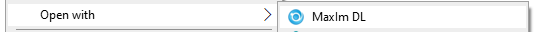

Enable crosshairs by right-clicking in your image and selecting 'Crosshairs -> Visible'.

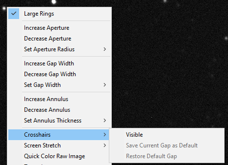

 You will likely need to zoom out to see your full image.<br>Use mouse wheel or the zoom buttons at the top --> 

Open the information window by clicking the information icon at the top , or via 'Ctrl + I' or via 'View -> Information Window'.

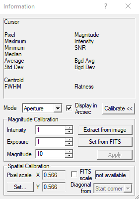

<div style="page-break-after: always;"></div>

Position the aperture over your target star (make sure to select the correct star, it might not be the one at/near the crosshair centre) and measure the maximum count (ideal is around 10,000-30,000). You can adjust the size of the aperture by right-clicking the image and selecting 'Set Aperture Radius'.

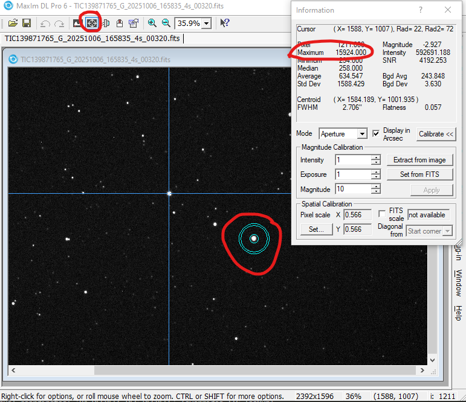

If counts are not appropriate, repeat procedure (take a new image) with a different exposure time. If the counts are too high, reduce the exposure time, if the counts are too low, increase the exposure time (remember a target's counts will usually increase as it rises in the sky, less atmosphere to see through). 

Once you have an optimised exposure time, you can proceed to Automated (Continuous) Photometry.

Close MaxIm DL.

<div style="page-break-after: always;"></div>

# Automated (Continuous) Photometry

Automated Photometry has one primary mode, where targets are resolved based on their TIC ID.

## Basic Usage

The program is called via:
```bash
python t2_photometry.py [TARGET] [OPTIONS]
```

### Using TIC ID
Any of these formats are acceptable:
```bash
python t2_photometry.py 123456789
python t2_photometry.py TIC123456789
python t2_photometry.py TIC-123456789
```

Target coordinates and magnitude will be determined via TIC lookup and default exposure time calculated based on Gaia G-mag. The exposure time can (and should) be overridden using command line arguments (use Single Image Mode above to determine optimal exposure time).

### Command Line Arguments
Command line arguments can be used for additional customization and to override program defaults.

| Option | Description | Default |
|--------|-----------|:---------:|
|`-h` or `--help` | Displays help message and exits | `-` |
|`--coords` | Resolves target based on J2000 coordinates ("RA_DEG DEC_DEG") instead of TIC ID | `-` |
|`--filter` | Selects the filter to use (L/B/G/R/C/I/H) | `C` |
|`--exposure-time` (Recommended) | Override exposure time calculations (seconds) | `-` |
|`--log-level` | Terminal display logging level (DEBUG/INFO/WARNING/ERROR) | `INFO` |
|`--duration` | Session duration (hours) | `-` |
|`--max-exposures` | Maximum number of exposures to take | `-` |
|`--ignore-twilight` | Bypass twilight (Sun Altitude) checks for daytime testing | `False` |
|`--no-park` | Skip telescope parking at end of session | `False` |

Notes:
- Filter options: L=Lum, B=Blue, G=Green, R=Sloan-r, C=Clear, I=Sloan-i, H=H-alpha
- Focuser position: The focuser position will automatically change based on the filter selected and pre-defined values in `config\devices.yaml` (under focuser['focus_positions']), you may need to manually alter the focuser position based on seeing conditions.
- Parking: The telescope will automatically slew back to home position at the end of the session, using the `--no-park` argument will leave it at its observing position (covers will still close and camera coolers will be turned off).
- Twilight: the telescope will automatically stop taking images once the target becomes unobservable due to either falling below 30° altitude or due to the Sun's position. Using `--ignore-twilight` will ignore the Sun's position and it will continue imaging indefinitely as long as the target remains above 30° altitude (regardless of the time of day or whether the dome is open or closed).
#### Examples

- To observe a TIC target with 10 second exposure time:
```bash
python t2_photometry.py 123456789 --exposure-time 10.0
```
- To observe a TIC target with 30 second exposure time with the Lum filter:
```bash
python t2_photometry.py 123456789 --exposure-time 30.0 --filter L
```
- To observe a target without a TIC ID via its J2000 coordinates (RA and Dec in decimal degrees) with 20 second exposure time with the Clear filter (Clear is the default):
```python
python t2_photometry.py --coords "256.263748 -42.17295" --exposure-time 20.0
```
<!-- - To observe a TIC target with 5 second exposure time and more detailed console logging:
```python
python t2_photometry.py 123456789 --exposure-time 5.0 --log-level DEBUG
``` -->
### On Observability
If your target is not immediately observable (hasn't risen about 30° altitude yet, or it is not quite twilight) the program will automatically keep checking for observability at regular intervals (60 seconds) and will automatically start observations once observability conditions are satisfied. E.g.:

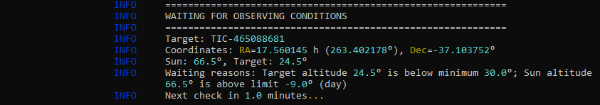

### Files and Directories
Directories are automatically created and files saved according to date (images in folders with the '_acq' suffix are used for target acquisition purposes), e.g.: `P:\Photometry\YYYY\YYYYMMDD\T2\TIC123456789`

<div style="page-break-after: always;"></div>

# Automated Spectroscopy

## Setting up for Spectroscopy

### Adjusting Tertiary Mirror
In Autoslew, ensure that the tertiary mirror is in Position 2.

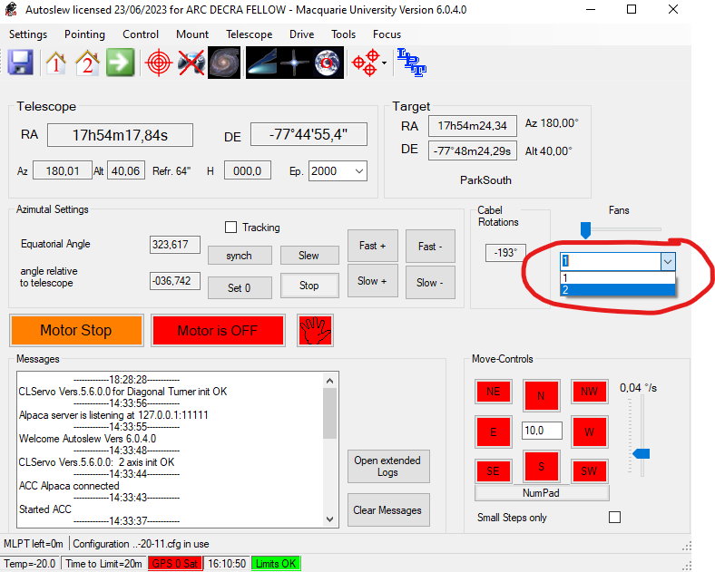

### Focus Adjustment

Focus adjustments should not be required, unless you are observing manually. The t2_spectro.py program should automatically handle moving the focuser to the required position for spectroscopy.

## Basic Usage
Automated Spectroscopy has three primary operating modes:
- **Single Target Mode via TIC ID** - Observe a specific TIC catalog target.
- **Single Target Mode via Coordinates** - Observe a specific target via J2000 coordinates.
- **Mirror Mode** - Continuously monitor another telescope via log parsing and mirror its targets.

The program is called via:
```bash
python t2_spectro.py [MODE] [TARGET] [OPTIONS]
```

### Using TIC ID

Any of these formats are acceptable:
```bash
python t2_spectro.py tic 123456789
python t2_spectro.py tic TIC123456789
python t2_spectro.py tic TIC-123456789
```

### Using Coordinates
```bash
python t2_spectro.py coords "44.5 -30.2"
```
*Note: Both RA and Dec coordinates are in decimal degrees.

### Using Mirror Mode
```bash
python t2_spectro.py mirror
```

#### Enable T5 Logging (for mirror mode only, on Telcom 5)

Log into Telcom5 and confirm that an instance of Windows Powershell is running in the taskbar, e.g.: 

If it's running and showing that it is copying lines, no further action is required and you can exit Telcom 5, e.g.: 

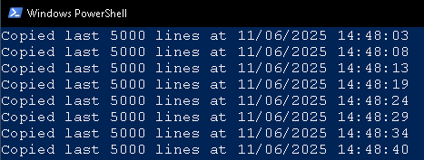

Otherwise, open Windows Powershell and type the following set of commands to start T5 logging:

```bash
P:
cd temp
powershell -ExecutionPolicy Bypass -File "P:\temp\copylog_T5.ps1"
```

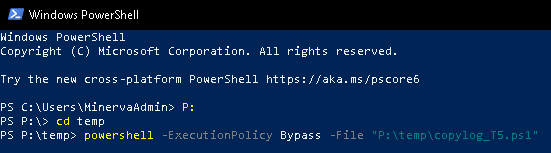

#### Log Parsing (for mirror mode only, on RaptorTCU)
To enable log parsing, open Windows Powershell from the Start Menu 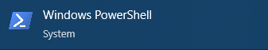

Run the following set of commands to change directories and start the log parser:
```bash
P:
cd temp
python parse_telcom_log.py
```
Leave Powershell running - it will continuously check for new spectroscopy targets and monitor dome closure messages from the other telescope.

### Command Line Arguments

Command line arguments can be used for additional customization and to override program defaults, though are generally not required in spectroscopy mode.

| Option | Description | Default |
|--------|-------------|:-------:|
|`--ignore-twilight` | Bypass twilight (Sun Altitude) checks for daytime testing (will also prevent shutdown) | `False` |
|`--exposure-time` | Override exposure time (seconds) | Set in config (adaptive) |
|`--duration` | Session duration (hours) | Set in config |
|`--poll-interval` | How often to check mirror file for new targets (seconds) | `10.0` |
|`--log-level` | Terminal display logging level (DEBUG/INFO/WARNING/ERROR) | `INFO` |
|`--dry-run` | Simulate without hardware movement or imaging | `False` |

### Imaging and Platesolving During Spectroscopy

Imaging during spectroscopy is only used for platesolving and guiding (positioning the star directly over the fibre), so the calculation of exposure times is adaptive, automatically adjusting based on responses from the external platesolver. 

### Files and Directories
Directories are automatically created and files saved according to date, e.g.: `P:\Spectroscopy\YYYY\YYYYMMDD\T2\TIC123456789`

<div style="page-break-after: always;"></div>

# Telescope Shutdown Tool (T2shutdown.exe) 

<!--  -->

### DO NOT use this tool during normal telescope operations - it will perform physical actions on telescope systems.

### This tool will NOT interact with the cameras at all. 

#### If you have used the cameras in other programs (e.g. MaxIM DL) you MUST stop the coolers and disconnect the cameras in those programs manually.

## In Automated Photometry or Spectroscopy

The telescope should automatically handle shutdown procedures in both automated photometry and spectroscopy modes, closing covers, stopping the rotator and parking the telescope (unless the `--no-park` argument is used which prevents parking, or the `--ignore-twilight` argument is used which ignores sunrise) at the end of observations.

However, program errors, TCU restarts or manual observations via other programs, for example, may require manual shutdown of the telescope into a safe operating mode. The T2shutdown.exe program can be used for this purpose.

## Using the Shutdown Tool

### 1. Open the Tool
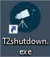 Open the tool by double-clicking the T2shutdown.exe file on the RaptorTCU Desktop -->

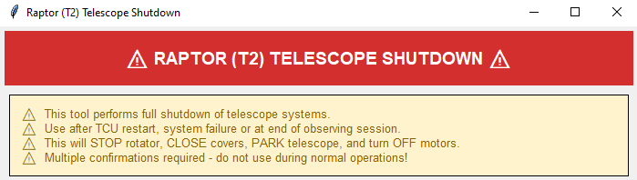

### 2. Initialise Connections

Ideally, Autoslew  and ASA ACC  should already be running, though the tool will try to launch them if it detects they are not running.

Click '1. Start Autoslew & Check Connections'


The program will detect whether Autoslew is running (and try to launch it if it doesn't) and initialise various connections (this full process can take up to 45 seconds).

#### If any security warnings or user account alerts pop-up, make sure to click 'Yes' to allow them.
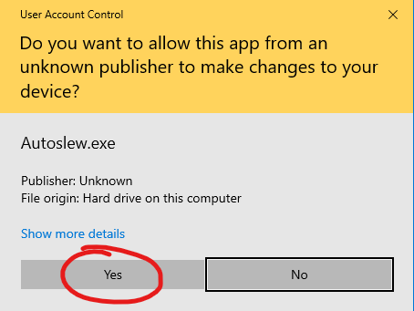

If successful, the system status for each device (Autoslew, Telescope, Rotator, Cover) should turn green and show their current status, e.g.:

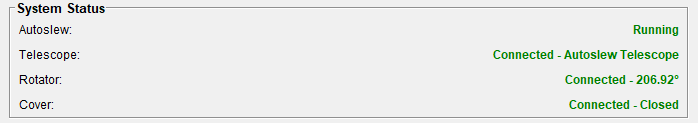

If unsuccessful, try re-checking connections by clicking '1. Start Autoslew & Check Connections' again. 

Note: You can proceed if not all devices are connected, the program will skip those which are not connected.

### 3. Shutdown the Telescope

Click '2. TELESCOPE SHUTDOWN'.


A series of warning messages will pop-up, if you continue past them the tool will stop the rotator, close the telescope covers, slew the telescope to its park position and turn off its motors.

<p align="center"> 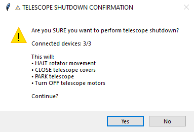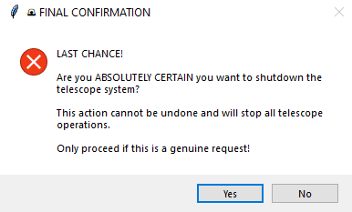</p>

If successful, the system status for each device should update, e.g.:

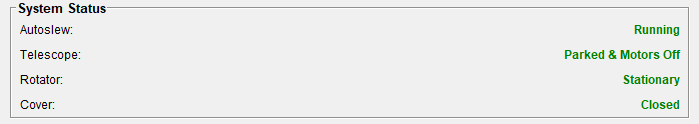

And the Activity Log should show successful completion, e.g.:

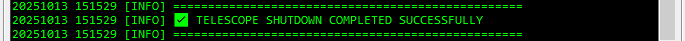

You can now exit the Shutdown Tool.

<div style="page-break-after: always;"></div>

## Closing the Dome (Telcom7)
### 1. Login to Telcom7 and Close the Dome (if observations have finished)

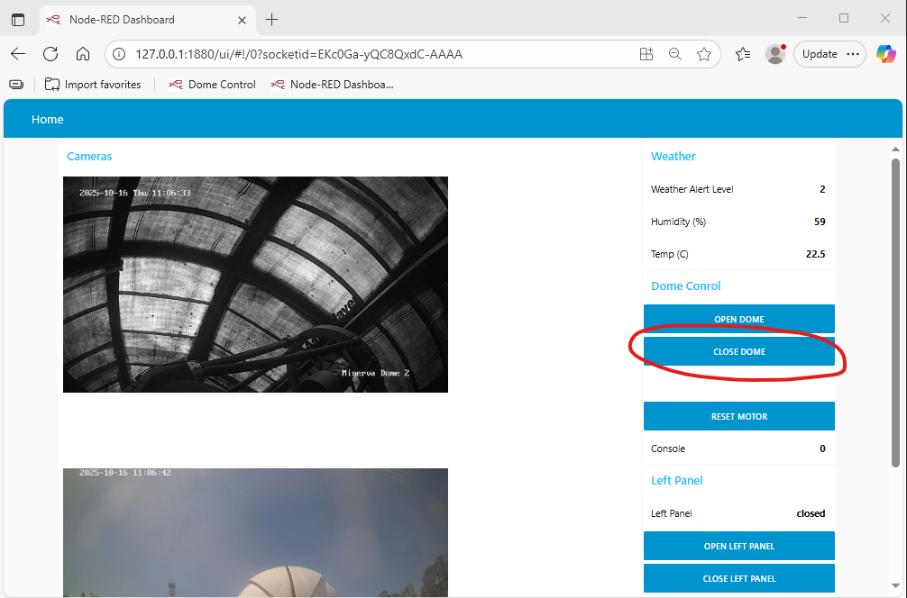

### 2. Confirm Dome has Closed via Cam


<div style="page-break-after: always;"></div>

# Troubleshooting

## Automation Terminal Issues

Where possible, all scripts should be run using the Automation<br>Terminal on the Desktop 'Automation Terminal T2' --> 


If this terminal is not working properly, the scripts *can* also be run in either<br>Command Prompt  or Windows Powershell ,<br>though **the program call MUST now include `-u`** (or the script will stall/hang), for example:
```bash
python -u t2_photometry.py 123456789
python -u t2_spectro.py tic 123456789 --exposure-time 15.0
```
Note: you will likely first need to change directories via a slightly different path, e.g.:
```bash
conda activate drivescope
cd Documents\JS\automation
```
## Field Rotator and Rotator Flips...


## Other troubleshooting


