# T2 (Raptor) Observatory Control System
## User Guide

**Version:** 1.0  
<!-- **System:** T2 / Raptor -->
<!-- **Audience:** Students and academic staff conducting observing sessions -->

---

<div style="display: flex; align-items: flex-start; gap: 30px;">

<div style="flex: 1; min-width: 300px;">

## Table of Contents

1. [Overview](#1-overview)
2. [Before You Start](#2-before-you-start)
3. [The Interface](#3-the-interface)
4. [Connecting to Devices](#4-connecting-to-devices)
5. [Device Cards](#5-device-cards)
   - [Dome](#51-dome)
   - [Telescope](#52-telescope)
   - [Rotator](#53-rotator)
   - [Focuser & Filter Wheel](#54-focuser-and-filter-wheel)
   - [Covers](#55-covers)
6. [Starting an Observing Session](#6-starting-an-observing-session)
7. [Ending an Observing Session](#7-ending-an-observing-session)
8. [Status Indicators](#8-status-indicators)
9. [System Log](#9-system-log)
10. [Closing the Application](#10-closing-the-application)
11. [Troubleshooting](#11-troubleshooting)
<!-- 12. [Moving the Filter Wheel via Script](#12-moving-the-filter-wheel-via-script) -->

</div>

<div style="flex: 0 0 350px;">
  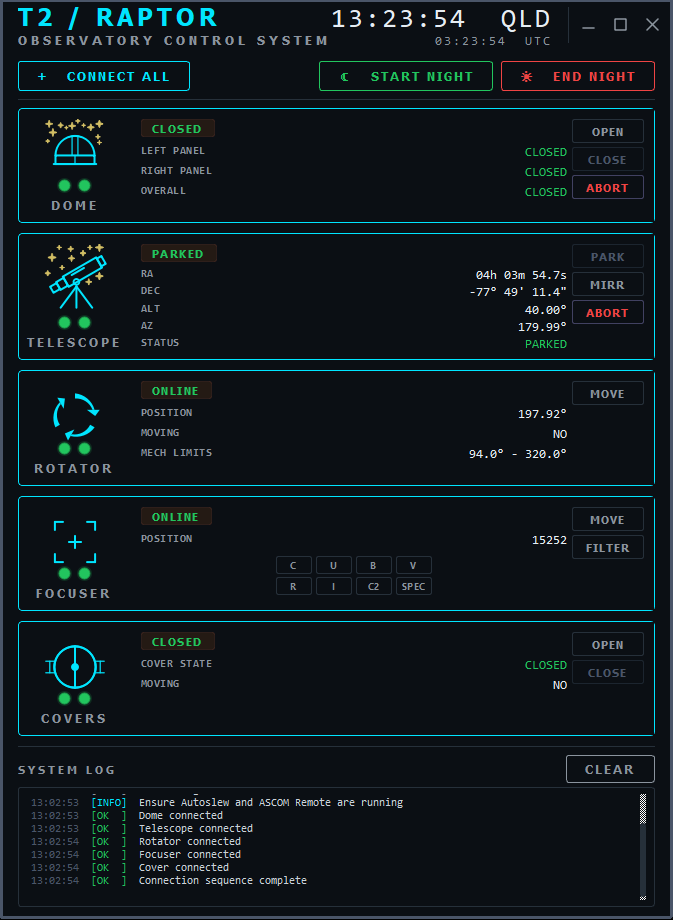
</div>

</div>

---

## 1. Overview

The T2 (Raptor) Observatory Control System is a purpose-built graphical interface that provides a unified control panel with select operations for the T2 dome, telescope/mount, covers, field rotator, filter wheel and focuser - allowing observers to connect, monitor, and operate each device from a single window without needing to interact with multiple separate software tools.

The system communicates with each hardware device via ALPACA (telescope, rotator, covers, focuser) and Node-RED HTTP (dome) protocols running locally on the Telescope Control Unit (TCU). **It does not control the telescope directly** (beyond parking and changing the tertiary mirror position) - Autoslew remains the primary mount control software and must be running for telescope functions to operate and to ensure connections to all devices are possible.

**Exclusions** - The cameras (and their coolers) also cannot be operated via this system, you must manually ensure coolers are disengaged after each observing session.

<div style="page-break-after: always;"></div>

---

## 2. Before You Start

Before launching the control system, ensure the following are already running on the TCU:

- **Autoslew** - the primary telescope mount control software. Without this, the telescope and other devices will not connect.
- **ASCOM Remote** - the ALPACA server that exposes device interfaces over the local network.
- **Node-RED** - the dome control flow. Without this, the dome will not connect. This operates on Telcom7, not this TCU.

> **If you are unsure whether these services are running**, check the Windows taskbar for their respective icons, or ask your supervisor before proceeding.

The control system will remind you of this requirement each time it starts.

---

## 3. The Interface

The application window is divided into the following sections from top to bottom:

<div style="display: flex; align-items: center; gap: 25px;">

### **Title Bar**

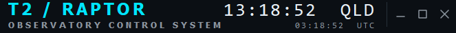

</div>

The custom title bar at the top of the window contains:

- **T2 / RAPTOR** - system identifier and subtitle
- **Local QLD time** (large) and **UTC time** (smaller) - both update every second
- **Window controls** - minimise, maximise/restore, and close buttons on the right

The title bar also acts as a drag handle - click and hold anywhere on it to reposition the window on screen. Double-clicking maximises or restores the window.

<div style="display: flex; align-items: center; gap: 25px;">

### **Controls Bar**


</div>

Directly below the title bar, a row of three buttons:
- **CONNECT ALL** - initiates connection to all devices in sequence
- **START NIGHT** - opens the session start options dialog
- **END NIGHT** - opens the session end / shutdown options dialog

<div style="display: flex; align-items: center; gap: 25px;">

### **Device Cards**

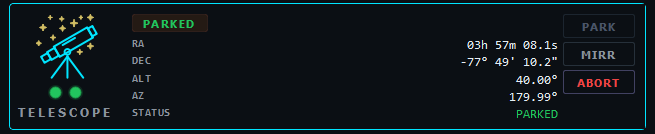

</div>

Five cards, one per device, each showing connection status, live data, and available actions. Cards are arranged vertically: Dome, Telescope, Rotator, Focuser, Covers.

<div style="page-break-after: always;"></div>

<div style="display: flex; align-items: center; gap: 25px;">

### **System Log**

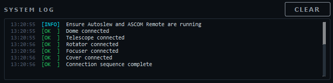

</div>

A scrolling log console at the bottom of the window recording all system events, connection attempts, command results, and errors with timestamps.

---

## 4. Connecting to Devices

<div style="display: flex; align-items: center; gap: 25px;">

### Connect All


</div>

The most common way to connect is to click **CONNECT ALL** in the controls bar. This initiates connections to all five devices in the following order: Dome -> Telescope -> Rotator -> Focuser -> Covers

Each device goes through three visible states during this process:

- <div style="display: flex; align-items: center; gap: 5px;">  Amber pulsing lamps - connection attempt in progress </div>
- <div style="display: flex; align-items: center; gap: 5px;">  Green lamps - successfully connected </div>
- <div style="display: flex; align-items: center; gap: 5px;">  Red lamps - connection failed </div>

Connections happen sequentially; each device updates one at a time. The CONNECT ALL button returns to its normal state once all attempts are complete. Connection attempt results are shown in the System Log.

### Connecting Individual Devices

If a specific device fails to connect, or if you need to connect/reconnect a single device during a session, click either of the two small **status lamps** on that device's card. This triggers a connect/reconnect attempt for that device only without affecting others.

### Connection Status

Each device card displays a **status badge** in its upper-left that shows the current state in plain text - OFFLINE, CONNECTING, CONNECTED, FAILED, or the operational state (e.g. PARKED, CLOSED, ONLINE). See [Section 8](#8-status-indicators) for a full colour reference.

---

## 5. Device Cards

Each device card follows the same layout:

- **Left column** - device icon (dims when disconnected, lights up when connected) with the device name and two status lamps underneath
- **Centre column** - status badge and live data rows
- **Right column** - action buttons

Clicking a status lamp reconnects that device individually.

<div style="page-break-after: always;"></div>

---

### 5.1 Dome

The dome card controls the sliding roof panels of the dome via Node-RED on the Telcom7 TCU.

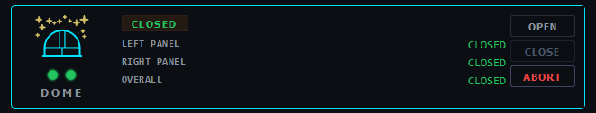

#### Live Data

| Field | Description |
|---|---|
| LEFT PANEL | State of the left dome panel |
| RIGHT PANEL | State of the right dome panel |
| OVERALL | Combined dome state |

#### Status Values

- **CLOSED** - panel(s) are fully closed
- **OPEN** - panel(s) are fully open
- **OPENING** - panel(s) are currently opening
- **CLOSING** - panel(s) are currently closing
- **PARTIAL** - left and right panels are in different states

#### Action Buttons

**OPEN** - opens both dome panels. A confirmation dialog is shown. Disabled if panels are already open or moving.

**CLOSE** - closes both dome panels. A confirmation dialog is shown. Always close the dome before ending a session. Disabled if panels are already closed or moving.

**ABORT** - sends an abort signal to the dome controller, halting panel movements. A confirmation dialog is shown. Use this if the panels are moving unexpectedly or need to stop urgently.

> **Note:** Dome status updates every 5 seconds. Full open or close travel takes approximately 45 seconds.

> **Important:** Always close the dome before closing the application or leaving the observatory.

<div style="page-break-after: always;"></div>

---

### 5.2 Telescope

The telescope card interfaces with the Autoslew mount via ASCOM/ALPACA.


#### Live Data

| Field | Description |
|---|---|
| RA | Current right ascension (HH h MM m SS.S s) |
| DEC | Current declination (±DD° MM' SS.S") |
| ALT | Current altitude above horizon in degrees |
| AZ | Current azimuth in degrees |
| STATUS | Current mount state |

#### Status Values

- **OFFLINE** - not connected
- **PARKED** - mount is in the park position
- **TRACKING** - mount is tracking a target normally
- **SLEWING** - mount is moving to a new position

#### Action Buttons

**PARK** - sends the park command to the mount. The telescope will slew to its designated park position and stop tracking. A confirmation dialog is shown before the command is sent. The button is automatically disabled once the telescope is already parked.

**MIRR** - opens the tertiary mirror selection dialog. Click either **PHOTOMETRY** or **SPECTROSCOPY** to select the desired Nasmyth port, then confirm in the following dialog. The mirror switch mechanism takes approximately 20 seconds to complete - the system logs completion when done. This button is only active when the telescope is connected.

**ABORT** - immediately aborts any current slew. Use this if the mount is moving unexpectedly or needs to stop urgently. A confirmation dialog is shown. This does not park the telescope - it simply halts the current motion.

> **Note:** The telescope position data updates automatically every 3 seconds while connected.

<div style="page-break-after: always;"></div>

---

### 5.3 Rotator

The rotator card monitors and controls the field rotator attached to the telescope.

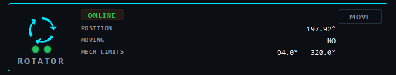

#### Live Data

| Field | Description |
|---|---|
| POSITION | Current rotator angle in decimal degrees (°)|
| MOVING | Whether rotator is currently moving |
| MECH LIMITS | Mechanical travel limits configured for this instrument |

#### Status Values

- **ONLINE** - rotator is connected and stationary
- **MOVING** - rotator is currently rotating

#### Action Buttons

**MOVE** - opens the rotator move dialog. The dialog shows the current position and the valid mechanical range (configured in the system settings). Enter a target position in decimal degrees and click MOVE, then confirm in the following dialog. The rotator will move to the requested position and the system logs completion.

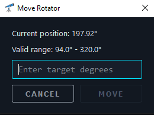

> **Note:** The rotator position updates every 5 seconds. The mechanical limits shown in the move dialog are hard limits - positions outside this range will be rejected by the driver.

> **Note:** There are no action buttons for routine operations beyond MOVE - the rotator is primarily a monitoring device during an observing session, with position adjustments made as needed between targets.

<div style="page-break-after: always;"></div>

---

### 5.4 Focuser and Filter Wheel

The focuser card controls the focuser (and filter wheel) and provides quick access to pre-configured positions.

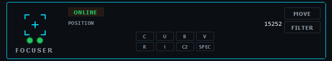

#### Live Data

| Field | Description |
|---|---|
| POSITION | Current focuser position (integer step count) |

#### Status Values

- **ONLINE** - focuser is connected and stationary
- **MOVING** - focuser is currently moving to a target position

#### Filter Position Buttons

A row of small buttons at the bottom of the card provides one-touch access to pre-configured focus positions for each photometric filter and the spectroscopy instrument. A confirmation dialog displays before moving. These positions are defined in the (`devices.yaml`) config file and update automatically if changed. These are simply starting positions and may require adjustment based on seeing conditions.

<!-- | Button | Filter / Instrument |
|---|---|
| C | Clear filter |
| U | Johnson U filter |
| B | Johnson B filter |
| V | Johnson V filter |
| R | Cousins R filter |
| I | Cousins I filter |
| C2 | Second clear position |
| SPEC | Spectroscopy instrument position | -->

> **Note:** This only affects the focuser position and does not change the filter wheel itself. The filter wheel must be controlled manually or via the `FILTER` action button.

#### Action Buttons

**MOVE** - opens the focuser move dialog. Displays the current position and valid range. Enter any target position within the valid range and click MOVE, then confirm. 
<!-- Use this for manual focus adjustments or custom positions not covered by the filter buttons. -->

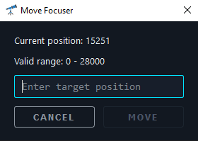

<!-- **HALT** - immediately stops focuser movement. A confirmation dialog is shown. Use this if the focuser is moving to an incorrect position or needs to be interrupted. -->

> **Note:** Focuser status updates every 3 seconds. Focus positions are typically five-digit numbers representing motor step counts.

**FILTER** - opens the filter wheel dialog. This button does not require connection to the focuser and is always active. Displays the currently selected filter and ASCOM position. Filters are defined in the (`devices.yaml`) config file and update automatically if changed. Connects and disconnects for every refresh/move action to handle COM port connection issues. Click REFRESH to show the currently selected filter. Click the filter to move the filter wheel to that position.

On startup:

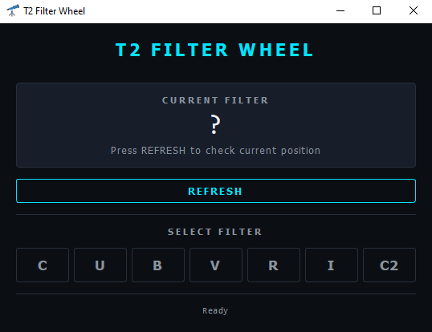

After REFRESH:

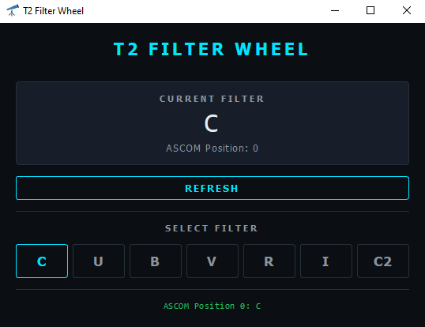

<!-- > **Note:** The pre-configured filter positions are starting points and may require fine adjustment using the telescope's autofocus routine (run via NINA or equivalent) depending on temperature and conditions on the night. -->

**The filter wheel can only handle a single connection at a time.** If any other program, script or app (e.g. MaximDL, ASI, NINA, automation scripts) is already connected to the filter wheel, connection will fail and an error message displayed:

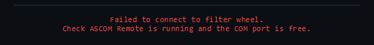

<div style="page-break-after: always;"></div>

---

### 5.5 Covers

The covers card controls the main telescope mirror covers.

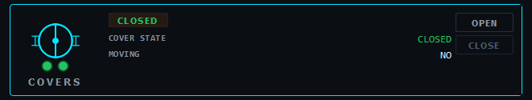

#### Live Data

| Field | Description |
|---|---|
| COVER STATE | Current state of the covers |
| MOVING | Whether the covers are currently moving |

#### Status Values

- **CLOSED** - covers are closed (safe state for daytime / end of session)
- **OPEN** - covers are open (required for observing)
- **OPENING** - covers are in motion, opening
- **CLOSING** - covers are in motion, closing
- **UNKNOWN** - state cannot be determined

#### Action Buttons

**OPEN** - commands the covers to open. A confirmation dialog is shown. The button is disabled while covers are already open or in motion.

**CLOSE** - commands the covers to close. A confirmation dialog is shown. The button is disabled while covers are already closed or in motion. Always close the covers before ending a session or if bad weather is approaching.

> **Note:** Cover status updates every 3 seconds. The covers take several seconds to complete their travel - the status will update to OPEN or CLOSED once motion is complete.

> **Important:** Always close the covers before parking the telescope at the end of a session.

<div style="page-break-after: always;"></div>

---

## 6. Starting an Observing Session


The **START NIGHT** button in the controls bar opens a checklist dialog allowing you to select which startup operations to perform. Check or uncheck each item as appropriate for your session, then click **EXECUTE**.

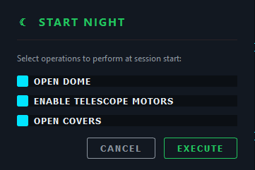

### Available Options

**Open dome** - sends the open command to both dome panels. A full open or close takes roughly 45s.

**Enable telescope motors** - sends the motor enable command to the mount. Required for slewing or tracking to function.

**Open telescope covers** - opens the mirror covers. A full open or close takes roughly 20s.

### Recommended Startup Sequence

For a typical observing session, check all three options and click EXECUTE. The system performs each operation in sequence with a short pause between steps. Monitor the System Log and device cards to confirm each step completes successfully before beginning observations.

> **Before clicking START NIGHT**, ensure the dome is physically safe to open - check weather conditions, confirm no personnel are in the dome area, and verify the telescope is not pointing at an obstruction.

<div style="page-break-after: always;"></div>

---

## 7. Ending an Observing Session

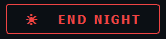

The **END NIGHT** button opens a checklist dialog for shutdown operations. Select the operations you want to perform and click **SHUTDOWN**.

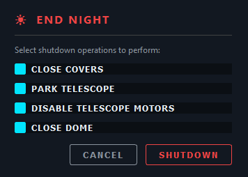

### Available Options

**Close covers** - closes the mirror covers. A full open or close takes roughly 20s.

**Park telescope** - slews the mount to the park position and stops tracking. Always park the telescope before closing the dome to avoid any risk of the dome panels striking the telescope tube.

**Disable telescope motors** - sends the motor disable command to the mount.

**Close dome** - sends the close command to both dome panels. A full open or close takes roughly 45s.

### Recommended Shutdown Sequence

Check all four options in the order shown and click SHUTDOWN. The system executes them sequentially:

1. Close covers
2. Park telescope
3. Disable telescope motors
4. Close dome

Monitor the System Log to confirm each step. Do not close the application until all steps have logged completion.

> **Important:** Did you remember to manually turn off the camera coolers?

<div style="page-break-after: always;"></div>

---

## 8. Status Indicators

### Lamp Colours

Each device card has two small circular lamps in the icon area:

|Lamp | Colour | Meaning |
|---|---|---|
|  | Dark grey | Not yet connected (startup state) |
|  | Pulsing amber | Connection attempt in progress |
|  | Green | Device connected and operational |
|  | Red | Connection failed or device offline |

### Status Badge Colours

The text badge in the upper-left of each card uses colour to indicate operational state:

| Colour | States |
|---|---|
| Green | CLOSED, PARKED, TRACKING, ONLINE, CONNECTED |
| Amber | OPEN, OPENING, CLOSING, PARKING, MOVING, SLEWING, CONNECTING |
| Red | OFFLINE, FAILED, ERROR, NOT CONNECTED |
| Grey | UNKNOWN, ? (no data) |

---

## 9. System Log

The System Log at the bottom of the window provides a timestamped record of all system activity. Entries are colour-coded by type:

| Colour | Type | Meaning |
|---|---|---|
| Cyan | INFO | General information and status updates |
| Green | OK | Successful operation or connection |
| Amber | WARN | Warning - something to be aware of but not a failure |
| Red | ERROR | A command failed or a connection could not be established |
| Grey | SYS | System-level events (startup, connection sequence initiation) |

All timestamps are shown in Local (QLD) Time.

The **CLEAR** button in the log header removes all current log entries. This does not affect system operation - it is purely a display reset for readability.

> The log is not saved to disk. If you need a record of a session, take a screenshot before closing the application.

---

## 10. Closing the Application

Click the **X** button in the top-right of the title bar:

 

A confirmation dialog will appear:

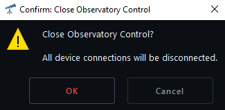

<!-- > *Close Observatory Control? All device connections will be disconnected.* -->

Click **OK** to confirm. The system will stop all background polling, disconnect from all devices, and close.

> **Do not close the application mid-session without first completing the End Night shutdown sequence.** Closing without parking the telescope or closing the dome does not cause the hardware to do anything - the devices will simply remain in whatever state they were in - but it is good practice to leave the observatory in a safe state before exiting.

---

## 11. Troubleshooting

### **A device shows FAILED after Connect All**

The most common causes are:

- Autoslew or ASCOM Remote is not running (for telescope, rotator, covers, focuser)
- Node-RED is not running (for dome)
- The device is not powered on or not physically connected

Try clicking the device's status lamps to retry that individual connection after checking the above. Check the System Log for specific error messages.

### **The telescope connects but shows no RA/Dec data**

This usually means Autoslew is running but not connected to the mount hardware. Open Autoslew and verify the mount is connected and tracking before retrying.

### **The dome does not respond to open/close commands**

This can take some time depending on the hardware (up to 120s), wait for a System Log message verifying failure. Verify Node-RED is running on the dome TCU. The dome TCU is a separate computer (Telcom7) - check that it is powered on and reachable on the observatory network. The dome may also automatically close based on weather and sky conditions.

<div style="page-break-after: always;"></div>

### **The covers show UNKNOWN after connecting**

The cover driver uses an alternative connection verification method due to reliability issues with the standard connected indicator. If UNKNOWN persists, try reconnecting by clicking the cover card lamps. If it continues, double-check that Autoslew and ASA Alpaca Gateway are running.

### **A move command (rotator or focuser) appears to do nothing**

Check the System Log for error messages. Common causes are that the target position is outside the mechanical limits, or that the device lost connection during the session. Try reconnecting the device and retrying the move.

### **The filter wheel does not connect, refresh or returns an error message**

The filter wheel can only handle a single connection at a time. If any other device, program, app or script is connected to the filter wheel, it will block this app. 

### **The application window has no border or title bar**

This is normal - the application uses a custom frameless window design. The title bar is the dark strip at the top with the T2/ RAPTOR title. Drag this area to move the window. Use the three buttons at the top right to minimise, maximise, or close. Click and drag the bottom right corner of the window to resize it.

---

*For hardware faults, unusual mount behaviour, or issues not covered in this guide, contact your supervisor, course coordinator or the observatory technical staff.*

---

<!-- <div style="page-break-after: always;"></div>

## Addendum

## 12. Moving the Filter Wheel via Script

The Observatory Control System cannot control the position of the filter wheel. Automated photometry and spectroscopy scripts should handle filter wheel changes as required during their normal operation. Manual changes to the position of the filter wheel can be made directly via other software (e.g. MaximDL) or via the following script.

> **IMPORTANT** The filter wheel can only be connected to one thing at a time, if any other program, script or app (e.g. MaximDL, ASI, NINA, automation scripts) is already connected to the filter wheel, this will fail.

To run the script open Windows Powershell and enter the following:

```bash
conda activate drivescope
cd Documents\JS\automation
```

For example:

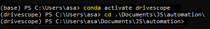

The script is called via `python movefw.py [OPTION]` where OPTION can be either the ASCOM numerical position of the chosen filter (0-6) or the letter denoting the chosen filter (C, U, B, V, R, I). For example:

```bash
python movefw.py C
python movefw.py 0
python movefw.py V
python movefw.py 3
```

The program will then connect to the filter wheel, check for its current position, move to the chosen filter (if not already there) and then disconnect from the filter wheel. For example:

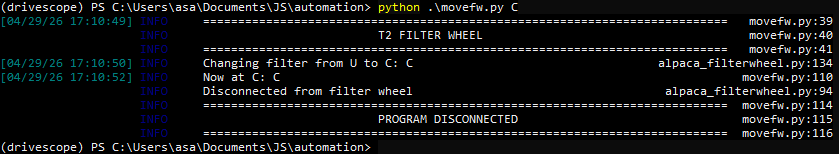


>**Note** To check the current position of the filter wheel run `python testingcode\fwstatus.py` (again assuming nothing else is connected to the filter wheel) and look for the '<---- CURRENT' indicator. If the '<---- CURRENT' indicator is not showing or if it reads 'Position -1', continue with a move command to your required filter. -->